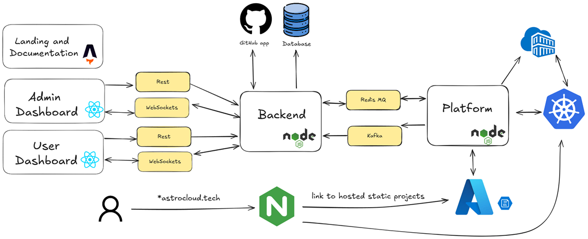

# AstroCloud GP Documentation

The purpose of this documentation is to provide insight into the AstroCloud GP project, including its features, demos, and architecture, without exposing the actual codebase as it is closed source, in hopes of growing into a commercial product in the future.

## Overview

Welcome to Egypt’s First Managed Cloud Hosting Platform!

AstroCloud is a Platform-as-a-Service (PaaS) developed as a graduation project aimed at empowering developers, startups, and businesses in Egypt with a fully managed cloud hosting solution.

AstroCloud simplifies application deployment and infrastructure management by supporting static and dynamic site hosting through GitHub integration or ZIP file uploads. It features an intuitive dashboard for managing deployments, along with continuous deployment, automated builds, and real-time log streaming.

## Demos

**Main Demo**

A comprehensive demonstration of the project, in which we deploy a full-stack registration system consisting of a backend and 2 frontends.

**Extra Features Demo**

Showcasing additional features such as CI/CD, instant rollbacks, and more.

**Landing and Documentation Page Demo**

A demonstration of the landing and documentation page, which serves as the first point of contact for users, providing an overview of the platform, its features, and user documentation.

**Admin Dashboard Demo**

A demonstration of the admin dashboard, which provides administrative functionality such as user and project management, user plans, and system statistics, and more.

## Architecture

### Main Components

- **User Dashboard**: The primary interface that users interact with. It allows users to manage their projects, monitor deployments, and configure settings.
- **Admin Dashboard**: Provides administrative functionality, including the ability to view all users, projects, and plans, along with access to advanced controls and system statistics.
- **Landing and Documentation Page**: The initial page presented to first-time visitors. It introduces the platform, showcases its capabilities, highlights available features, and contains user documentation and examples.
- **Backend**: The backend is responsible for processing user actions and requests. It acts as the intermediary between the frontend and the platform, handling business logic, API endpoints, and coordination between services.
- **Platform**: The platform handles all hosting and deployment operations, including building, deploying, and managing both static and dynamic projects.

### Supporting Components

- **Postgres**: The main relational database used to store application data.
- **Redis**: Used as a message queue for deployment requests.
- **Kafka**: Used for event streaming and real-time data processing, such as log streaming.
- **Nginx**: Acts as a reverse proxy for the backend, and a router that forwards project deployment links to the appropriate services.
- **Azure Blob Storage**: Stores files for all statically hosted websites.
- **GitHub**: Integrated for version control and CI/CD workflows.
- **Azure Kubernetes Service (AKS)**: Hosts the main Kubernetes cluster used for deploying and managing dynamic applications.
- **Azure Container Registry (ACR)**: Stores container images for dynamic projects.

### Interactions between Components

- **Frontend ↔ Backend**: Communicate via **RESTful APIs** and **WebSocket** connections.
- **Backend ↔ Platform**: Use **BullMQ (message queue)** and **Kafka (publish/subscribe)** for asynchronous, decoupled communication. This architecture enables independent development, testing, deployment, and scaling of each component.

## Features

### General Deployment Features:
- GitHub Integration.
- SSL certificates for deployed applications.
- CI/CD pipelines for automated deployments from GitHub repositories on updates, for both static and dynamic applications.
- Live build logs streaming during deployments, using WebSockets and Kafka.
- Edit and rebuild applications directly from the dashboard.
- View previous builds and their logs and status.

### Static Hosting (Frontend Websites):
- Deploying GitHub repositories.
- Building frameworks like Angular, React, Vue, and Svelte.
- Supports ZIP file uploads for static sites, using pre-signed URLs for uploads.

### Dynamic Hosting (Backend Applications):
- Deploying Node.js applications.
- Deploying from GitHub repositories or ZIP file uploads.
- Health checks and automatic restarts for applications.
- Auto-scaling capabilities based on traffic.
- Rollback support for previous versions.
- Kernel-level isolation for security and performance with MicroVMs.
- Runtime Logs accessible through the dashboard for debugging and monitoring.

### Side Features:
- Login with GitHub and refresh tokens for secure access.
- Monorepository setup for sharing code between the backend and the various frontends.
- User Plans authorization system for managing user access and features.

### Automation and DevOps:
- Automated production deployment pipeline for our system, to deploy the whole system with a single click.
- CI and quality assurance checks for all pull requests.

## Detailed Documentation

For a deeper dive into the project, please refer to the following documents:

- [**Project Architecture**](./project-architecture.md)
- [**Project Management**](./project-management.md)

