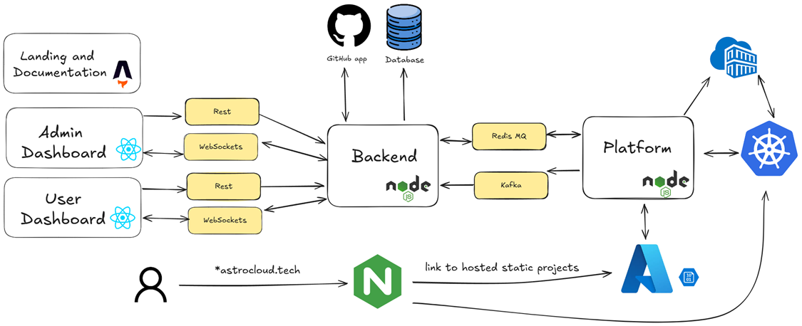

# Architecture



## Main Components (Sub-Projects)

- **User Dashboard**: The primary interface that users interact with. It allows users to manage their projects, monitor deployments, and configure settings.
- **Admin Dashboard**: Provides administrative functionality, including the ability to view all users, projects, and plans, along with access to advanced controls and system statistics.
- **Landing and Documentation Page**: The initial page presented to first-time visitors. It introduces the platform, showcases its capabilities, highlights available features, and contains user documentation and examples.
- **Backend**: The backend is responsible for processing user actions and requests. It acts as the intermediary between the frontend and the platform, handling business logic, API endpoints, and coordination between services.
- **Platform**: The platform handles all hosting and deployment operations, including building, deploying, and managing both static and dynamic projects.

## Supporting Components

- **Postgres**: The main relational database used to store application data.
- **Redis**: Used as a message queue for deployment requests.
- **Kafka**: Used for event streaming and real-time data processing, such as log streaming.
- **Nginx**: Acts as a reverse proxy for the backend, and a router that forwards project deployment links to the appropriate services.
- **Azure Blob Storage**: Stores files for all statically hosted websites.
- **GitHub**: Integrated for version control and CI/CD workflows.
- **Azure Kubernetes Service (AKS)**: Hosts the main Kubernetes cluster used for deploying and managing dynamic applications.
- **Azure Container Registry (ACR)**: Stores container images for dynamic projects.

## Interactions between Components

- **Frontend ↔ Backend**: Communicate via **RESTful APIs** and **WebSocket** connections.
- **Backend ↔ Platform**: Use **BullMQ (message queue)** and **Kafka (publish/subscribe)** for asynchronous, decoupled communication. This architecture enables independent development, testing, deployment, and scaling of each component.


## 🧩 Sub-Projects Overview

The project is organized as a **monorepo**, containing multiple related services and shared packages within a single repository. This structure enables streamlined development, unified dependency management, and seamless code sharing across the backend, frontend, and platform components.

### 🖥 Backend

- Provides a REST API using Express
- Real-time communication via WebSockets
- Integrates with PostgreSQL, Redis, Kafka, GitHub App, and Azure
- Handles authentication and background job queues
- Technologies:
  - Node.js
  - Express.js
  - TypeScript
  - Prisma and PostgreSQL (for database interactions)
  - Redis and BullMQ (for caching and message queuing)
  - Socket.IO (for websocket communication)
  - Octokit (for GitHub App integration)
  - Kafka (for event streaming)
  - Azure SDK (for cloud interactions)
  - Zod (for request validation)

### ⚙️ Platform

- Interfaces with containers and cloud infrastructure using:
  - Dockerode
  - Kubernetes Client for Node.js
  - Azure SDK
- Executes privileged tasks and coordinates service orchestration
- Pushes results to processing queues

### 🌐 Frontend

- Built with React and TailwindCSS
- Sub-projects:
  - `admin-page/`: Admin interface for managing users and system state.
  - `landing-page/`: Public-facing landing site. Built with Astro.
  - `user-dashboard/`: Main user experience for interacting with the system.

### ♻️ Shared Package

- Type definitions shared across all sub-projects
- Common constants, utilities, and services
- Promotes type safety and code reusability


## 📁 Folder Structure

```
AstroCloud/
├── apps/               # Main sub-projects:
│  ├── backend/         # API, WebSocket, database, GitHub App
│  ├── frontend/        # UI: landing, dashboard, admin
│  │  ├── admin-page/   # Admin dashboard
│  │  ├── landing-page/ # Public landing page
│  │  └── user-dashboard/ # User dashboard
│  └── platform/     # Dockerode SDK, Kubernetes, Azure integration
├── config/         # Docker services configurations
│  ├── gateway/      # API Gateway configuration
│  ├── smee/         # Webhook delivery proxy
│  └── webserver/    # Static webserver setup
├── infrastructure/ # Infrastructure as Code (IaC) and automation
│  ├── ansible/      # System configuration & provisioning
│  ├── scripts/      # Utility scripts for deployment/dev
│  └── terraform/    # Cloud IaC definitions
├── packages/       # Shared modules across apps
│  └── shared/       # Shared types, constants, and logic
├── docker-compose-prod.yml # Production docker compose
├── docker-compose.yml      # Development docker compose with file watching.
├── Dockerfile       # Root Dockerfile for multi-service builds
└── ...
```