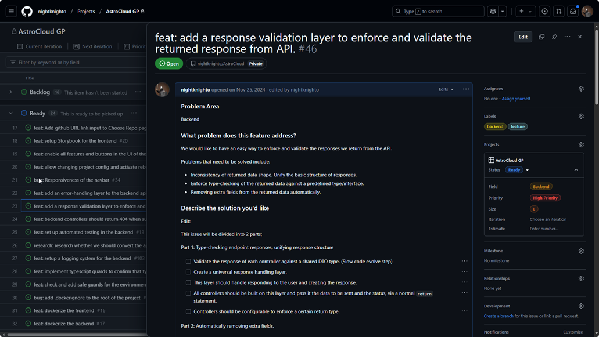
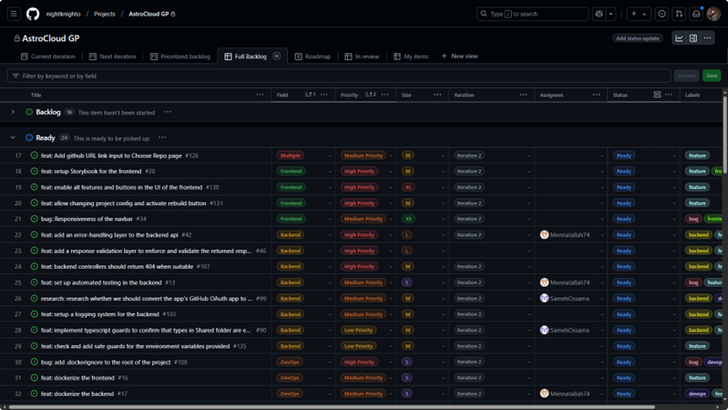
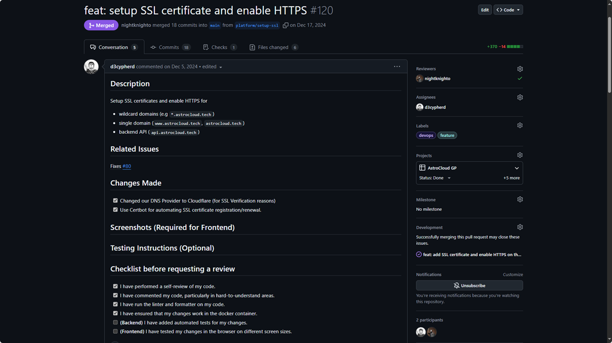

# Project Management

Project Manager: [Ahmed Atwa](https://github.com/nightknighto)

## Demo

A quick demonstration of our project management approach, showcasing how we utilized GitHub Issues and Projects to manage tasks, track progress, and ensure quality through pull requests.

## Overview
Our project management approach was centered around **GitHub Issues** and **GitHub Projects**, ensuring structured backlog management, prioritization, and task tracking.

We operated in iterations, with two-week cycles where we planned, executed, and reviewed progress. This structured approach allowed us to continuously evaluate our progress, iterate on feedback, and make necessary adjustments to ensure smooth project execution.

## GitHub Issues: Tracking Features, Bugs, and Ideas

We used GitHub Issues to track every feature, bug, or idea. Each issue was structured to ensure clarity, including the following sections:

- **Problem Area** – Specifies the field relevant to the issue (e.g., Backend, Frontend, DevOps).
- **Problem Statement** – Clearly defines the problem the feature or bug fix is addressing.
- **Proposed Solution** – Outlines how the issue should be resolved, sometimes divided into multiple implementation parts.
- **Additional Context** – Links to relevant resources, discussions, or references that help in solving the issue.

## GitHub Project: Backlog and Task Management

All issues were organized within a GitHub Project, structured into four main categories:

- **Backlog** – Newly created issues that were yet to be assigned, serving as a holding space for future tasks.
- **Ready** – Tasks selected for the current iteration, prioritized based on business needs and technical feasibility.
- **In Progress** – Tasks actively being worked on, ensuring visibility of what’s currently being developed.
- **Done** – Completed and merged tasks, allowing the team to track what has been delivered.

Each issue was assigned metadata for clarity and prioritization:

- **Field** – Categorized as Frontend, Backend, DevOps, Design, or Multiple, ensuring relevant team members could quickly identify tasks related to their area of expertise.
- **Priority** – Marked as Low, Medium, or High, allowing the team to focus on urgent and impactful tasks first.
- **Size** – Estimated effort: XS, S, M, L, or XL, providing a clear expectation of effort required for each task.
- **Iteration** – Indicating which iteration the task belonged to, ensuring better planning and accountability.
- **Assignees** – The responsible team members, providing clear ownership of tasks.

## Pull Requests: Ensuring Quality and Safety

Pull requests were enforced to ensure code quality and safety. Each PR followed a standardized structure:

- **Description** – A summary of the changes made, including new features or fixes.
- **Related Issues** – References to the GitHub Issues that the PR resolves.
- **Changes Made** – A detailed breakdown of modifications, listing affected files and components.
- **Testing Instructions** – Steps to verify the changes, including manual testing procedures or automated test cases.
- **Checklist Before Requesting Review** – A set of self-check items, ensuring that the code meets quality standards before review.

## GitHub-Driven Workflow

Each team was responsible for self-managing its workflow, ensuring that members were aware of their assigned tasks. When a team member picked a task:

1. They assigned themselves to the **GitHub Issue** and moved it to **In Progress**, keeping the team updated on their progress.

2. Once development was completed, a **Pull Request (PR)** was created, linked to the issue, ensuring all work was reviewed before merging.

3. Each PR required two approvals before merging:
    - One from the team leader to ensure technical quality and adherence to standards.
    - One from the project manager to validate alignment with the project’s overall goals.

4. Merging a PR automatically closed its associated issue and moved it to **Done**, streamlining the workflow.

